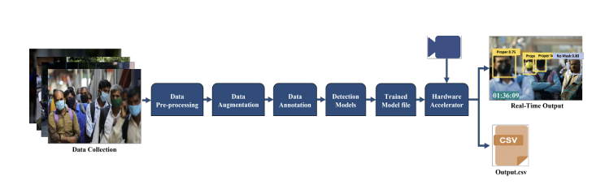

# Real-time Face Mask Detection System on Edge using Deep Learning and Hardware Accelerators

## Overview

This project presents a Real-Time Face Mask Detection and Classification system using Artificial Intelligence and Deep Learning techniques. The system is capable of detecting whether a person is:

- Wearing a mask correctly
- Wearing a mask incorrectly
- Not wearing a mask

The solution is implemented using state-of-the-art YOLOv5 Object Detection models and optimized for Edge AI deployment on NVIDIA Jetson platforms.

The system can:
- Perform real-time inference
- Count detected persons/masks
- Store detection logs into CSV files with timestamps
- Run efficiently on embedded Edge AI hardware

  

### System Architecture

The proposed workflow consists of the following stages:

1. Data Collection
2. Data Pre-processing
3. Data Augmentation
4. Data Annotation
5. Model Training (YOLOv5)
6. Hardware Accelerator Deployment
7. Real-Time Inference
8. CSV Logging and Analytics

## Models Used

- YOLOv5s
- YOLOv5l

---

## Hardware Platforms

- NVIDIA Jetson Nano
- NVIDIA Jetson Xavier NX

---

## Features

- Real-time face mask detection
- Mask wearing condition classification
- Live camera/video stream inference
- CSV logging with timestamps
- Detection counting system
- Edge AI optimized deployment
- Lightweight and scalable architecture

## Performance Results

| Model | mAP (%) |
|--------|----------|
| YOLOv5s | 86.43 |
| YOLOv5l | 92.49 |

### Performance Observation

- YOLOv5l achieved higher detection accuracy compared to YOLOv5s.
- NVIDIA Jetson Xavier NX delivered significantly better FPS performance than Jetson Nano for real-time inference.

---
## Technologies Used

- Python
- PyTorch
- OpenCV
- YOLOv5
- CUDA
- TensorRT
- Edge AI

## Applications

- Smart Surveillance Systems
- Public Safety Monitoring
- Industrial Safety Compliance
- Smart City Solutions
- Healthcare Monitoring
- Transportation Hubs

---

## Future Improvements

- Multi-camera support
- TensorRT optimization
- Cloud dashboard integration
- AI analytics reporting
- Mobile deployment support

---

## Research Reference

This project is based on the research paper:

**"Real-time Face Mask Detection System on Edge using Deep Learning and Hardware Accelerators"**

IEEE Publication:  
https://ieeexplore.ieee.org/abstract/document/9689421

